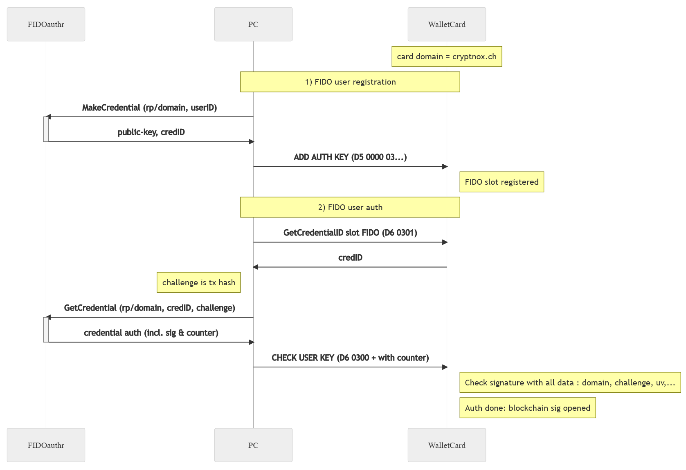

User key & configuration commands
=================================

.. _cmd-add-user-key:

ADD USER KEY
------------

**Request APDU** (encrypted)

.. list-table::
   :header-rows: 1
   :widths: 12 12 12 12 12 40

   * - CLA
     - INS
     - P1
     - P2
     - LC
     - Data
   * - ``0x80``
     - ``0xD5``
     - ``0x00``
     - ``0x00``
     - var
     - MAC | Encrypted data

**Preconditions**: Secure Channel must be opened.

This command registers a user public key in one of three slots. User keys provide an alternative
authentication mechanism to the PIN: instead of typing a numeric code, the user proves identity by
signing a challenge or a transaction hash with their private key. This enables integration with
hardware security modules like iOS Secure Enclave, PC TPMs, or external FIDO authenticators.

Each slot accepts a different key type, and once a key is written to a slot, it must be deleted
with :ref:`DELETE USER KEY <cmd-delete-user-key>` before a new key can be stored in the same slot.
The key is accompanied by a 64-byte free-text description that can be read back with the
:ref:`READ DATA <cmd-read-data>` command (P1=slot index, P2=0).

**Request Data --- Slot 1 (EC 256r1, plaintext)** --- 142 bytes

Slot 1 stores an EC secp256r1 public key in X9.62 uncompressed format. This is the standard
NIST P-256 curve, widely supported by secure enclaves and TPMs.

.. list-table::
   :header-rows: 1
   :widths: 25 15 60

   * - Field
     - Size
     - Description
   * - Slot index
     - 1B
     - ``0x01``
   * - Info text
     - 64B
     - User-defined description (fixed 64 bytes, padded if shorter)
   * - Public key
     - 65B
     - EC 256r1 uncompressed (``04 | X | Y``)
   * - PUK
     - 12B
     - PUK for authorization

**Request Data --- Slot 2 (RSA 2048, plaintext)** --- 333 bytes

Slot 2 stores a 2048-bit RSA public key. Only the modulus is transmitted; the public exponent
is fixed at 65537 (``0x010001``) and is not sent.

.. list-table::
   :header-rows: 1
   :widths: 25 15 60

   * - Field
     - Size
     - Description
   * - Slot index
     - 1B
     - ``0x02``
   * - Info text
     - 64B
     - User-defined description (fixed 64 bytes)
   * - RSA modulus
     - 256B
     - 2048-bit modulus, big-endian. Exponent must be 65537.
   * - PUK
     - 12B
     - PUK for authorization

.. note::

   RSA commands require the extended frame format header, as the payload exceeds 256 bytes.

**Request Data --- Slot 3 (FIDO, plaintext)** --- variable

Slot 3 is a special slot designed for FIDO2/WebAuthn authenticators. In addition to the EC public
key, it stores the FIDO credential identifier, which is needed by the host to request an assertion
from the external authenticator during the :ref:`CHECK USER KEY <cmd-check-user-key>` flow.

.. list-table::
   :header-rows: 1
   :widths: 25 15 60

   * - Field
     - Size
     - Description
   * - Slot index
     - 1B
     - ``0x03``
   * - Info text
     - 64B
     - User-defined description (fixed 64 bytes)
   * - CredID length
     - 1B
     - Length of credential ID (up to 64)
   * - CredID
     - 1-64B
     - FIDO credential identifier
   * - EC public key
     - 65B
     - EC 256r1 uncompressed (``04 | X | Y``)
   * - PUK
     - 12B
     - PUK for authorization

**Status Words**

.. list-table::
   :header-rows: 1
   :widths: 20 80

   * - SW
     - Description
   * - ``0x9000``
     - Success
   * - ``0x6A80``
     - Invalid slot index
   * - ``0x6700``
     - Incorrect data length
   * - ``0x6985``
     - PIN not provided
   * - ``0x6984``
     - Invalid public key
   * - ``0x6986``
     - Slot already has a key (delete first)

.. note::

   For the current implementation, EC public keys are not tested for point-on-curve validity when
   saved. On JCOP 4 platforms, the underlying hardware performs this validation implicitly during
   cryptographic operations.

----

.. _cmd-check-user-key:

CHECK USER KEY
--------------

**Request APDU** (encrypted)

.. list-table::
   :header-rows: 1
   :widths: 12 12 12 12 12 40

   * - CLA
     - INS
     - P1
     - P2
     - LC
     - Data
   * - ``0x80``
     - ``0xD6``
     - Mode
     - ``0x00``
     - var
     - MAC | Encrypted data

**Preconditions**: Secure Channel must be opened.

This command authenticates the user using a public key previously registered with
:ref:`ADD USER KEY <cmd-add-user-key>`. A successful user key authentication is equivalent to
a PIN verification. There are two distinct authentication modes, serving different purposes:

1. **Auth for Sign** (P1=0x00 or P1=0x10): The user signs the transaction hash(es) to authorize
   a subsequent ``SIGN`` command. The card verifies the signature and, on success, unlocks the
   ``SIGN`` command for exactly those hash(es).

2. **Challenge-Response** (P1=0x01 then P1=0x02): The user requests a random challenge from
   the card, signs it with their private key, and sends the signature back. On success, this
   unlocks all commands that normally require PIN (except ``SIGN``).

.. important::

   The card cannot be simultaneously unlocked for "PIN" commands and for ``SIGN``. When the PIN
   is not used, management commands must be unlocked via challenge-response (P1=1/2), then
   the ``SIGN`` must be unlocked separately via auth-for-sign (P1=0/0x10).

**P1=0x00 --- Auth for Sign (single hash)**

.. list-table::
   :header-rows: 1
   :widths: 25 15 60

   * - Field
     - Size
     - Description
   * - Slot index
     - 1B
     - ``0x01``-``0x03``
   * - Hash
     - 32B
     - Transaction hash to authorize
   * - Signature
     - var
     - EC 256r1 ASN.1 DER (slot 1/3) or RSA 2048 PKCS#1 (slot 2)

On success (response = ``0x01``), the ``SIGN`` command is unlocked for this specific hash only.

**P1=0x10 --- Auth for Sign (hash list)**

When multiple transactions need to be signed in one session, this mode accepts a list of up to
4 hashes (or 3 for FIDO slot). The signed message includes a count byte followed by the
concatenated hashes.

.. list-table::
   :header-rows: 1
   :widths: 25 15 60

   * - Field
     - Size
     - Description
   * - Slot index
     - 1B
     - ``0x01``-``0x03``
   * - Hash count
     - 1B
     - Number of hashes (1--4, or 1--3 for FIDO)
   * - Hash list
     - n x 32B
     - Hashes to authorize (32B each)
   * - Signature
     - var
     - EC 256r1 ASN.1 DER (slot 1/3) or RSA 2048 PKCS#1 (slot 2)

**P1=0x01 --- Challenge Request**

No data required (or MAC only). The card generates a random 256-bit nonce and returns it.
This challenge must then be signed by the user and submitted with P1=0x02.

**Response Data** --- 32 bytes

.. list-table::
   :header-rows: 1
   :widths: 25 15 60

   * - Field
     - Size
     - Description
   * - Challenge
     - 32B
     - Random 256-bit nonce

**P1=0x02 --- Challenge Response**

The user submits the signed challenge to prove they hold the private key. The hash is not included
in the data because the card uses the challenge it generated internally.

.. list-table::
   :header-rows: 1
   :widths: 25 15 60

   * - Field
     - Size
     - Description
   * - Slot index
     - 1B
     - ``0x01``-``0x03``
   * - Signature
     - var
     - Signature of the challenge (hash is provided by card internally)

On success (response = ``0x01``), this unlocks commands requiring PIN (except ``SIGN``).

**P1P2=0x0301 --- Read FIDO Credential ID**

Returns the credential ID associated with the FIDO user key slot (slot 3), which the host needs
to request an assertion from the external FIDO authenticator.

**Response Data**:

.. list-table::
   :header-rows: 1
   :widths: 25 15 60

   * - Field
     - Size
     - Description
   * - CredID length
     - 1B
     - Length of credential ID
   * - CredID
     - var
     - FIDO credential identifier

**FIDO Registration and Authentication Flow**

The following diagram illustrates the complete FIDO2 user registration and authentication flow
between the external FIDO authenticator, the host PC, and the wallet card:

   FIDO2 user registration (ADD USER KEY) and authentication (CHECK USER KEY) sequence.

**FIDO Signature Format (Slot 3)**

When slot 3 is used for auth-for-sign or challenge-response, the data format differs from
EC/RSA slots because it must include the FIDO monotonic counter. The card verifies the signature
as a WebAuthn "user verified" assertion:

.. code-block:: none

   sha256(rp_id) | 0x05 | counter | sha256(clientData)

Where ``rp_id = "cryptnox.ch"`` and ``clientData`` is a fixed JSON template:

.. code-block:: json

   {
     "type": "webauthn.get",
     "origin": "https://cryptnox.ch",
     "challenge": "<base64url-encoded hash>",
     "clientExtensions": {}
   }

**FIDO auth-for-sign data format:**

.. list-table::
   :header-rows: 1
   :widths: 25 15 60

   * - Field
     - Size
     - Description
   * - Hash(es)
     - 32-97B
     - Transaction hash(es) to authorize
   * - Counter
     - 4B
     - FIDO monotonic counter
   * - EC signature
     - var
     - EC 256r1 ASN.1 DER

**FIDO challenge-response data format (P1=0x02):**

.. list-table::
   :header-rows: 1
   :widths: 25 15 60

   * - Field
     - Size
     - Description
   * - Counter
     - 4B
     - FIDO monotonic counter
   * - EC signature
     - var
     - EC 256r1 ASN.1 DER

The FIDO slot is limited to 3 hashes (instead of 4) when using the hash-list mode (P1=0x10).

**Response Data (all modes except Challenge Request and CredID read)** --- 1 byte

.. list-table::
   :header-rows: 1
   :widths: 25 15 60

   * - Field
     - Size
     - Description
   * - Result
     - 1B
     - ``0x01`` = success, ``0x00`` = signature verification failed

.. note::

   A return value of ``0x00`` with status ``0x9000`` means the signature was not properly verified:
   either the signature is invalid or the user key for this slot was not initialized. After a
   failed challenge attempt, a new challenge must be requested (P1=1) before retrying (P1=2).

**Status Words**

.. list-table::
   :header-rows: 1
   :widths: 20 80

   * - SW
     - Description
   * - ``0x9000``
     - Success (check result byte for verification outcome)
   * - ``0x6A80``
     - Invalid slot index or incorrect data
   * - ``0x6985``
     - FIDO key not registered (CredID read), or P1=2 sent before P1=1, or challenge
       expired (power cycle/deselect)

----

.. _cmd-delete-user-key:

DELETE USER KEY
---------------

**Request APDU** (encrypted)

.. list-table::
   :header-rows: 1
   :widths: 12 12 12 12 12 40

   * - CLA
     - INS
     - P1
     - P2
     - LC
     - Data
   * - ``0x80``
     - ``0xD7``
     - ``0x00``
     - ``0x00``
     - var
     - MAC | Encrypted data

**Preconditions**: Secure Channel must be opened.

Deletes the user public key from the specified slot. Once a key has been written to a slot with
:ref:`ADD USER KEY <cmd-add-user-key>`, it cannot be overwritten directly --- it must first be
deleted with this command. The PUK is required for authorization, providing an additional layer
of protection against unauthorized key removal.

**Request Data (plaintext)** --- 13 bytes

.. list-table::
   :header-rows: 1
   :widths: 25 15 60

   * - Field
     - Size
     - Description
   * - Slot index
     - 1B
     - ``0x01``-``0x03``
   * - PUK
     - 12B
     - PUK for authorization

**Status Words**

.. list-table::
   :header-rows: 1
   :widths: 20 80

   * - SW
     - Description
   * - ``0x9000``
     - Success
   * - ``0x6A80``
     - Invalid slot index
   * - ``0x6700``
     - Data length not 13 bytes
   * - ``0x63Cx``
     - Wrong PUK (x = remaining tries before power cycle)
   * - ``0x6986``
     - Slot is empty (nothing to delete)

----

.. _cmd-set-pinless-path:

SET PINLESS PATH
----------------

**Request APDU** (encrypted)

.. list-table::
   :header-rows: 1
   :widths: 12 12 12 12 12 40

   * - CLA
     - INS
     - P1
     - P2
     - LC
     - Data
   * - ``0x80``
     - ``0xC1``
     - ``0x00``
     - ``0x00``
     - var
     - MAC | Encrypted data

**Preconditions**: Secure Channel opened, seed or extended key loaded.

This command enables the pinless signing feature, which allows the ``SIGN`` command to be executed
without PIN authentication or even a secure channel. This is specifically designed for contactless
(NFC) payment transactions where typing a PIN is impractical, such as tap-and-pay at a point of
sale.

For security, the pinless path is restricted to a BIP32 derivation path that must begin with the
EIP-1581 prefix ``m/43'/60'/1581'``. EIP-1581 defines a purpose path for non-wallet usage of keys,
providing a clear segregation between pinless keys and standard PIN-protected wallet keys.
Despite this naming, the keys can still be used for wallet transactions --- the path restriction
is purely a security boundary.

The path must be at least 3 levels deep and at most 8 levels. It is provided as raw 32-bit
big-endian integers, 4 bytes per level, in the same format as the ``DERIVE KEY`` command.

This feature only supports the K1 (secp256k1) key pair.

**Request Data --- Enable pinless (plaintext)**

.. list-table::
   :header-rows: 1
   :widths: 25 15 60

   * - Field
     - Size
     - Description
   * - PUK
     - 12B
     - PUK for authorization
   * - Path elements
     - 12-32B
     - 3-8 levels x 4 bytes (32-bit big-endian)

Path must start with ``m/43'/60'/1581'`` (EIP-1581 prefix):

.. code-block:: none

   0x8000002B | 0x8000003C | 0x8000062D | ...

**Request Data --- Disable pinless (plaintext)**

To disable the pinless feature, send the command with only the PUK and no path data. The PUK
verification still applies.

.. list-table::
   :header-rows: 1
   :widths: 25 15 60

   * - Field
     - Size
     - Description
   * - PUK
     - 12B
     - PUK for authorization (no path = disable)

**Status Words**

.. list-table::
   :header-rows: 1
   :widths: 20 80

   * - SW
     - Description
   * - ``0x9000``
     - Success
   * - ``0x63Cx``
     - Wrong PUK (x = remaining tries before power cycle)
   * - ``0x6A80``
     - Data length not a multiple of 4, or path not between 12 and 32 bytes
   * - ``0x6983``
     - Path doesn't start with EIP-1581 prefix (``m/43'/60'/1581'``)
   * - ``0x6985``
     - No seed or extended key loaded (checked before PUK)

----

.. _cmd-set-pin-auth:

SET PIN AUTH
------------

**Request APDU** (encrypted)

.. list-table::
   :header-rows: 1
   :widths: 12 12 12 12 12 40

   * - CLA
     - INS
     - P1
     - P2
     - LC
     - Data
   * - ``0x80``
     - ``0xC3``
     - ``0x00``
     - ``0x00``
     - var
     - MAC | Encrypted data

**Preconditions**: Secure Channel must be opened.

This command controls whether PIN-based authentication is allowed. By default, both PIN and user
key authentication are available. Disabling PIN auth forces the user to authenticate exclusively
through the :ref:`CHECK USER KEY <cmd-check-user-key>` mechanism (EC/RSA/FIDO signatures).

This is useful in high-security deployments where a numeric PIN is considered insufficient and
all authentication must go through a hardware key (Secure Enclave, TPM, FIDO authenticator).

When disabling PIN auth (status byte > 0), the card verifies that at least one user public key
has been registered; otherwise it returns ``0x6986``. This prevents accidentally locking the user
out of the card.

To re-enable PIN auth, call this command with the status byte set to ``0x00``.

**Request Data (plaintext)** --- 13 bytes

.. list-table::
   :header-rows: 1
   :widths: 25 15 60

   * - Field
     - Size
     - Description
   * - Status
     - 1B
     - ``0x00`` = enable PIN auth; ``>0`` = disable PIN auth
   * - PUK
     - 12B
     - PUK for authorization

**Status Words**

.. list-table::
   :header-rows: 1
   :widths: 20 80

   * - SW
     - Description
   * - ``0x9000``
     - Success
   * - ``0x63Cx``
     - Wrong PUK (x = remaining tries before power cycle)
   * - ``0x6A80``
     - Data length is not 13 bytes
   * - ``0x6986``
     - Disable requested but no user public key loaded

----

.. _cmd-set-pub-export:

SET PUB EXPORT
--------------

**Request APDU** (encrypted)

.. list-table::
   :header-rows: 1
   :widths: 12 12 12 12 12 40

   * - CLA
     - INS
     - P1
     - P2
     - LC
     - Data
   * - ``0x80``
     - ``0xC5``
     - Feature
     - ``0x00``
     - var
     - MAC | Encrypted data

**Preconditions**: Secure Channel opened, seed loaded.

This command controls two independent public key export features. Both are disabled by default
from factory and after every card reset, ensuring that public key data is not accidentally exposed.

**P1=0x00 --- Extended public key (xpub) export**

Enables or disables the ability to read extended public keys (BIP32 xpub) via the
:ref:`GET PUBKEY <cmd-get-pubkey>` command with P2=0x02. The xpub contains the chain code and
is sufficient to derive all child public keys at that level and below, making it a sensitive piece
of data that allows address enumeration.

**P1=0x01 --- Clear public key reading (without PIN or SC)**

Enables or disables the ability to read the current public key without PIN verification or even
a secure channel. This is designed for point-of-sale scenarios where a reader needs to identify
the card's payment address via a simple NFC tap. When enabled, the public key can be read by
anyone with physical access to the card.

**P1 values**

.. list-table::
   :header-rows: 1
   :widths: 15 85

   * - P1
     - Description
   * - ``0x00``
     - xpub export capability
   * - ``0x01``
     - Clear public key reading (without PIN or SC)

**Request Data (plaintext)** --- 13 bytes

.. list-table::
   :header-rows: 1
   :widths: 25 15 60

   * - Field
     - Size
     - Description
   * - Status
     - 1B
     - ``0x00`` = disable; ``>0`` = enable
   * - PUK
     - 12B
     - PUK for authorization

**Status Words**

.. list-table::
   :header-rows: 1
   :widths: 20 80

   * - SW
     - Description
   * - ``0x9000``
     - Success
   * - ``0x63Cx``
     - Wrong PUK (x = remaining tries before power cycle)
   * - ``0x6A80``
     - Data length is not 13 bytes
   * - ``0x6985``
     - No seed or extended key loaded
   * - ``0x6A86``
     - P1 is not 0 or 1
